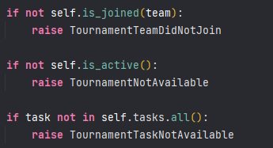

# HighTechCross

## Tech specification

See the project requirements in the file: [TECHNICAL_PROPOSAL.md](./docs/TECHNICAL_PROPOSAL.md)

## Примечания по техническим решениям.

#### 👨‍💻 Как запустить проект?

```bash
docker-compose up --build
docker-compose exec django bash
python manage.py migrate
```

#### Как сделать тестирование?

```bash
docker-compose run --rm django python manage.py test
```

#### 🗞 А где документация?

Я добавил `Swagger`. Посмотреть все доступные эндпоинты, а также протестировать:

- [schema/api/](http://localhost:3000/schema/api/)
- [schema/swagger-ui/](http://localhost:3000/schema/swagger-ui/)
- [schema/redoc/](http://localhost:3000/schema/swagger-ui/)

#### Почему TextField, а не CharField + max_length?

Лучше проверять длину на стороне контроллера, чем потом запускать миграции :)

#### Почему вместо read/write_only_fields используется extra_kwargs?

Пытался разобраться в проблеме, нашел ответ, что они используются для более широкого взаимодействия(???). В
общем, `extra_kwargs` решает эту проблему. Вероятно, был смысл попробовать разные версии DRF.

#### Что за паста из if'ов?


Чуть больше времени нужно на реализацию декораторов