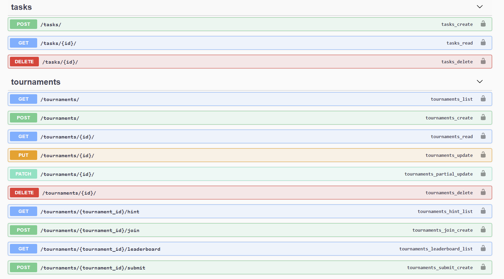
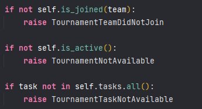
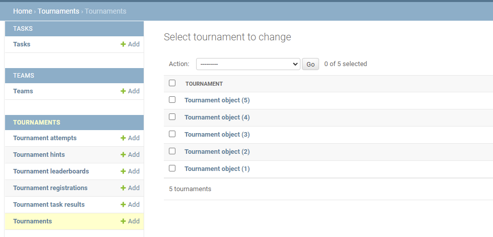

# HighTechCross

## Tech specification

See the project requirements in the file: [TECHNICAL_PROPOSAL.md](./docs/TECHNICAL_PROPOSAL.md)

## Примечания по техническим решениям.

#### 👨‍💻 Как запустить проект?

```bash
docker-compose up --build
docker-compose exec django bash
python manage.py migrate
```

#### Как сделать тестирование?

```bash
docker-compose run --rm django python manage.py test
```

#### 🗞 А где документация?

Я добавил `Swagger`. Посмотреть все доступные эндпоинты, а также протестировать:

- [swagger/](http://localhost:3000/swagger/)



#### Почему TextField, а не CharField + max_length?

Лучше проверять длину на стороне контроллера, чем потом запускать миграции :)

#### Почему вместо read/write_only_fields используется extra_kwargs?

Пытался разобраться в проблеме, нашел ответ, что они используются для более широкого взаимодействия(???). В
общем, `extra_kwargs` решает эту проблему. Вероятно, был смысл попробовать разные версии DRF.

#### Что за паста из if'ов?



Чуть больше времени нужно на реализацию декораторов, либо кастомизацию пермишен классов.

#### Забыл что-нибудь реализовать?

Может быть забыл что-то доделать, слишком много кода получилось))

Под конец тестового задания понял для себя, что не могу без agile/scrum, потому что весь процесс разработки шел довольно
медленно, а задачи пришлось проверять по небольшому содержанию тестового задания

#### Как блин с этим взаимодействовать?

Я, честно говоря, на старте сделал глупость с моделью Teams (лучше бы через FG на пользователей), авторизация может быть
чуть-чуть кривой. Но в админке работает и норм))

